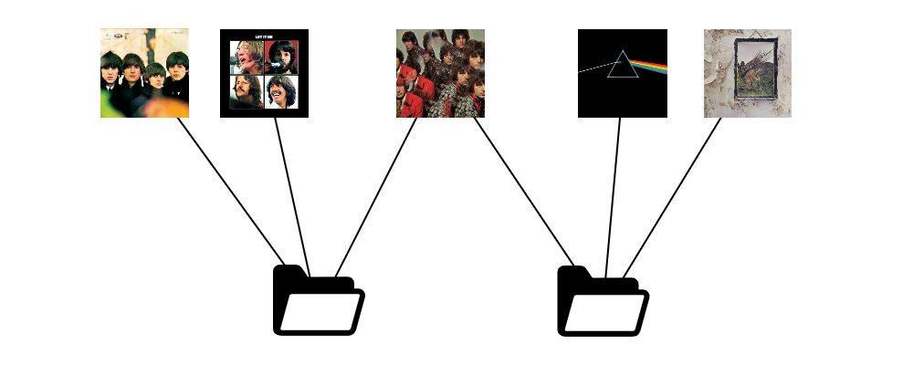

# Spotify-Graph



TBA

## Utilities

Download a 30sec mp3 clip for every song to "dataset/clips":
```
python util.py download_clips
```

Download the album cover jpg for every song to "dataset/images":
```
python util.py download_images
```


Remove all album nodes, keeping only a pure playlist-song graph.
```
python util.py remove_albums [new_save_dir]
```

## SpotifyGraph class
The SpotifyGraph class provides a simple interface for working with the dataset.
```python

from spotify_graph import SpotifyGraph

dataset = SpotifyGraph("./dataset", features_dir=None)
# dataset.tracks = track metadata dict
# dataset.collections = playlist/album metadata dict
# dataset.graph = raw list of edges

g, track_ids, col_ids = dataset.to_nx_graph()
# g = a NetworkX graph object

# e.g. print the titles of popular songs, which appear in >100 playlists:
for tid in track_ids:
    if g.degree(tid) > 100:
        print(dataset.tracks[tid]["name"])
    

```